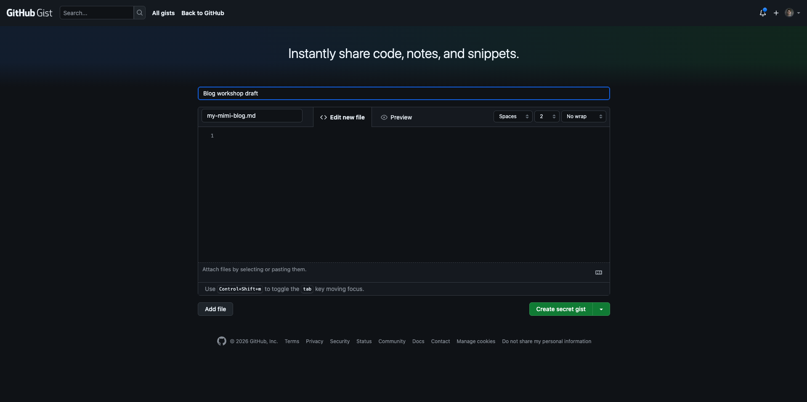

# Exercise 2: Writing Your Mini Blog

The aims of this exercise are to:

- get a rough first draft of your mini blog written
- introduce you to Markdown

## Instructions

Using your idea from [Exercise 1](../exercises/excercise-1.md), spend 15 minutes writing a rough first draft of your mini blog in Markdown. Don't worry about getting it perfect. The goal is just to get something down.

To write your draft, navigate to [gist.github.com](https://gist.github.com) and create a new gist. Make sure to name your file with a `.md` extension (e.g. `my-mini-blog.md`) so that GitHub renders it as Markdown. You can click the **Preview** tab at any time to see how your draft looks when rendered.



> **What is Markdown?**
> Markdown is a lightweight markup language for adding formatting to plain text documents. When you write a Markdown file, a parser reads the syntax and converts it into another format, most commonly HTML, which is what makes it so versatile. It's used everywhere from blogs and documentation to GitHub READMEs and chat apps.
>
> Note that there are different flavours of Markdown with slightly different syntax: for example GitHub Flavored Markdown (used in gists) supports some features that standard Markdown doesn't. For this exercise either will work fine.
>
> For a full guide to Markdown syntax, check out [markdownguide.org/basic-syntax](https://www.markdownguide.org/basic-syntax/).

Your mini blog should have:

- a title
- a short introduction (even just a sentence or two)
- a few short sections or paragraphs
- a brief conclusion

Aim for a few hundred words in total. Here's an example of what it might look like:

```markdown
# What I Learned at codebar Festival 2026

**This week I went to the Codebar Festival**, a hybrid event bringing together both coaches and students from the [codebar](https://codebar.io) community for workshops and talks.

codebar is a charity that helps under represented groups enter the tech industry though workshops and events like the festival.

At the festival I was hoping to learn more about Javascript as I'm pursuing a career in web app development.

## Javascript Workshop

The Javascript workshop was really interesting, I particular like the quiz covering all the weird behaviors of `this`. 

I've covered the basic of Javascript before but it was useful to look into some best practices whilst coding a little fizz buzz app.

## Deno Workshop

I hadn't heard of Deno (node spelled backwards!) before this workshop. It was eye opening learning about different JavaScript runtimes and it was a lot of fun building the dinosaur jumping game.

## Conclusion


I really enjoyed going to the codebar Festival and I learned heaps. I got major FOMO because some of the JavaScript sessions were at the same time but I guess I can watch the recordings later.

If you're trying to learn JavaScript like me I'd definitely recommend checking out codebar!
```

Save your gist when you're done—you'll use the content in [Exercise 3](../exercises/excercise-3.md).

## Next Steps

You should now have a rough outline based on your blog idea from [Exercise 1](../exercises/excercise-1.md), that you can use to create a draft blog post. In [Exercise 3](../exercises/excercise-3.md), you will publish your mini blog. This will introduce you to the process making a contribution to a public GitHub repo and using a static site generator to render it.