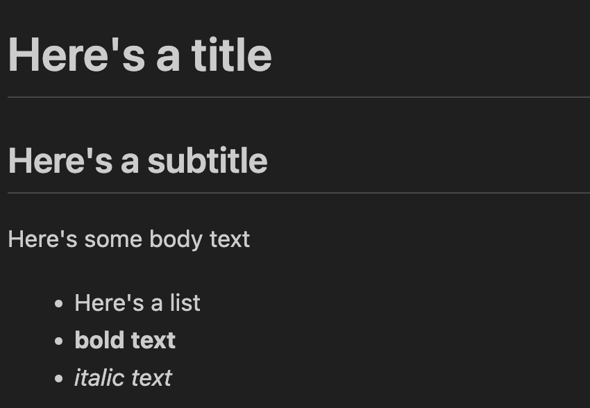

# Exercise 2: Create an outline for a blog

The aims of this exercise are to:
- help make it easier to get started drafting your blog
- introduce Markdown 

## What is Markdown?

Markdown is a lightweight markup language used to add formatting to plain text documents. Markdown is widely supported and easy to use which makes it a great choice for publishing blogs.

You might write something like this in Markdown:

```
# Here's a title
## Here's a subtitle

Here's some body text

- Here's a list
- **bold text**
- *italic text*
```

And then use a blogging platform like Medium or a static site generator like Jekyll or Hugo to turn it into pre-rendered static html that looks something like this:



## Instructions

Using your blog idea from [exercise 1](../exercises/excercise-1.md) create an outline in Markdown for your blog. 

> New to Markdown. Check out [www.markdownguide.org/basic-syntax](https://www.markdownguide.org/basic-syntax/) for a full guide on creating Markdown documents.

Your outline should have:
- a title
- an introduction*
- section headings
- an conclusion* 

*Just a few bullet points is fine

Here's an example of what you're finished outline should look like:

```
# What I learned at codebar festival 2026
Introduction
What codebar and codebar festival are
Why I went and what I hoped to learn
## Javascript workshop
## Career Talk
## Deno workshop
## Conclusion
Highlights from the year
Workshops that I missed I wished I saw
Hopes for next time
```

Save your outline as a `.md` file ready for [exercise 3](../exercises/excercise-3.md).

## Conclusion

You should now have a rough outline based on your blog idea from [exercise 1](../exercises/excercise-1.md) that you can use to create a draft of a full blog. In [exercise 3](../exercises/excercise-3.md) we will publish your outline to a blog feed of outlines to introduce you to the process making a contribution to a public GitHub repo and using a static site generator (in this case Jekyll) to render it.

