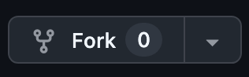
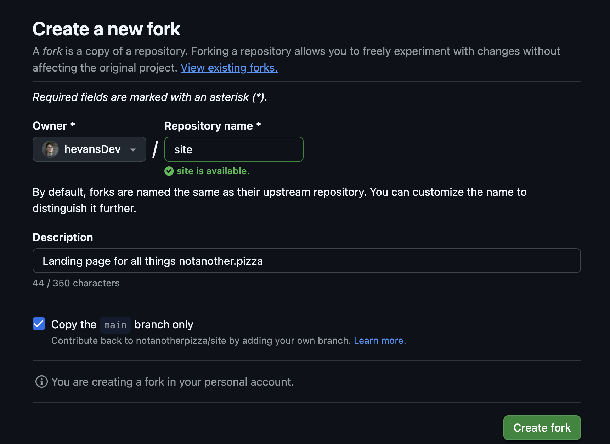
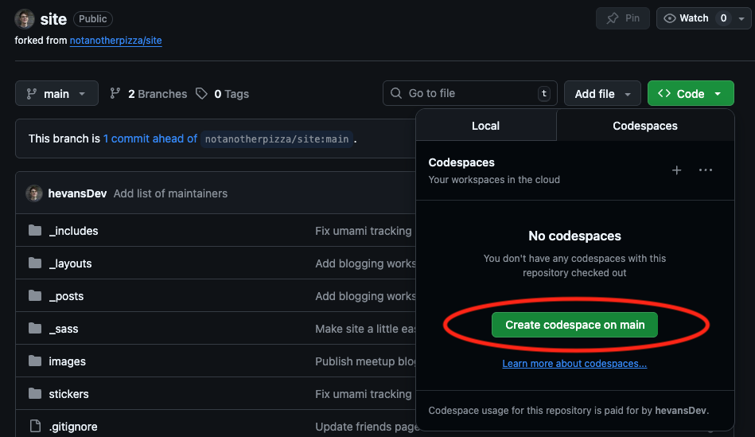
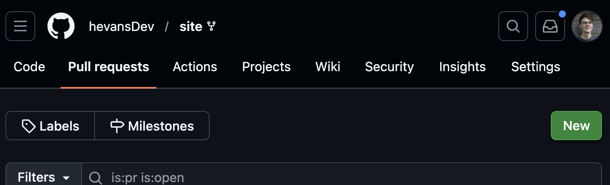
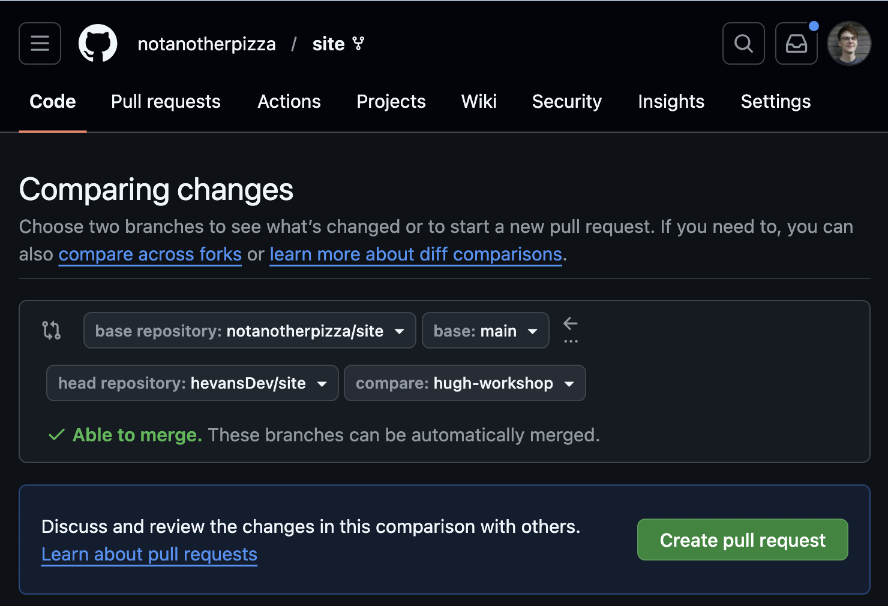

# Exercise 3: Raise a Pull Request and Publish Your Mini Blog

The aims of this exercise are to familiarize you with the process of contributing a blog in Markdown to a public GitHub repo, and using a static site generator, in this case Jekyll, to publish it.

Not all blogs use a static site generator. However, this exercise will equip you with the skills to publish blogs to those that do. It will introduce many of the key concepts necessary to complete [challenge 2](../challenges/challenge-2.md).

> Before you start, this is a much longer exercise than the previous two, so don't worry if you don't finish it in the workshop time! You can still follow the steps below and complete this exercise after the session.

## What is a Pull Request?

A pull request, or PR, is a way of requesting that the maintainers of a repository "pull" your code changes into their main branch. In this exercise, we'll use a PR to add your mini blog [to this blog feed](https://notanother.pizza/blog-workshop/) on the [notanother.pizza](https://notanother.pizza) website.

## Instructions

> If you'd prefer a video tutorial you can [watch the video guide here](https://youtu.be/SIp1NAp55NE).

1. Fork the [notanother.pizza/site repo](https://github.com/notanotherpizza/site) by navigating to and clicking the "fork" button on the top right of the page.

> "Forking" a repo creates a copy of the upstream repo (in this case notanotherpizza/site) that you can make changes to, later on you can contribute these changes back to the upstream branch via a PR, this process saves the maintainers from having to individually grant access to contributors and means anyone can suggest changes. This basic process underpins most open-source contributions. Neat!



You can leave all the settings as the defaults and click "Create Fork".



2. Create a codespace which will allow you to edit the repo in your browser (this can take a few minutes).



3. Create a new branch by copy-pasting the following into the terminal at the bottom of the codespace and pressing enter.

```bash
git checkout -b blog-workshop
```

4. Create a new Markdown (.md) file in the `_posts` directory. It should have today's date and the title of your blog in the following format `yyyy-mm-dd-your-blog-title.md`, for example: `2025-04-15-Not-Another-Update.md` .

5. Copy your draft from [Exercise 2](../exercises/excercise-2.md) into your newly created file.

> Optional: view roughly what your finished blog will look like by right clicking on your new file in your codespace and clicking preview.

6. At the beginning of your file, add the following block. This is called [front matter](https://jekyllrb.com/docs/front-matter/) and it's a short section of YAML metadata that Jekyll reads before rendering your page.
Front matter tells Jekyll things like which layout template to use, what the post title is, and who wrote it. Anything between the two `---` delimiters is front matter, and it won't appear in your published blog post.

```frontmatter
---
layout: post
title: My Mini Blog
author: your-name
category: workshop
---
```

7. Commit your changes to your local branch and push to the remote branch with:

```bash
git add .

git commit -m "Workshop date"

<<<<<<< HEAD
git push -u origin blog-workshop
```

8. Back in GitHub create a PR. Select merge to `notanotherpizza/site` by navigating to the Pull Request tab and clicking **New**.



In the Create PR screen, select the `main` branch as the target and your newly created branch as the source. Click **Create Pull Request**.



9. Wait for it to be approved. [Ping a maintainer](https://github.com/hevansDev/site?tab=readme-ov-file#maintainers) to make this faster. Once it's approved, you can click the **Merge** button in the PR to merge your changes to the remote and add your changes to the repo.

10. Once your changes are merged to `notanotherpizza/site` the Jekyll GitHub action will render the changes and update the GitHub Pages website. You should be able to see your published mini blog [here](https://notanother.pizza/blog-workshop/)!

## Next Steps

Congratulations on successfully publishing your mini blog and completing the beginners' blog workshop. If you enjoyed this session, why not try [challenge 1](../challenges/challenge-1.md) and turn your mini blog into a full length version, and then use the process above to update your mini blog into a finished blog post?

Once you've done that, you can always try [challenge 2](../challenges/challenge-2.md): hosting your own blog on GitHub pages.

=======
git push

in github create a PR and select merge to main

Wait for it to be approved and merged

Look at your publish outline at https://notanother.pizza/blog-workshop/
>>>>>>> 2131d06 (Rough outline of slides / resources)
