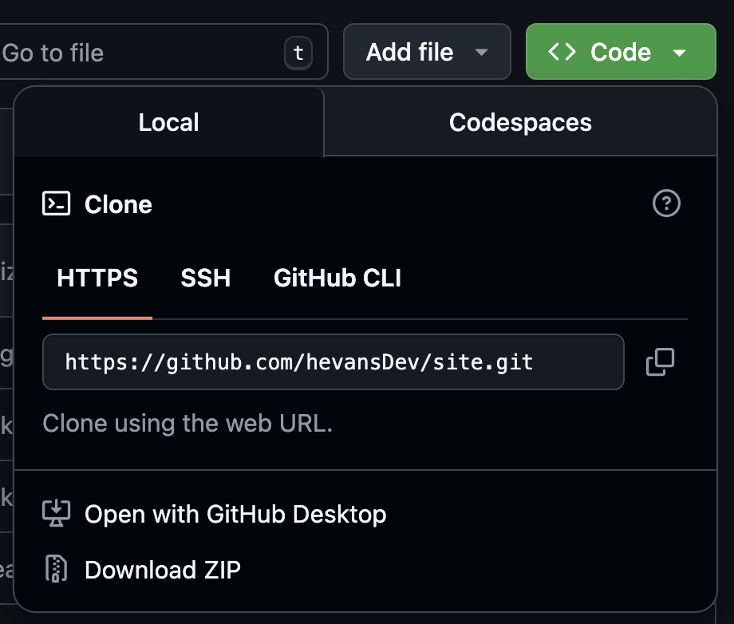

# Exercise 3: Raise a Pull Request and Publish Your Outline

The aims of this exercise are to familiarize you with the process of

- making a contribution to a public GitHub repo
- using a static site generator, in this case Jekyll, to render it

Not all blogs use a static site generator. However, this exercise will you equip you with the skills you need to publish blogs to those that do. It will introduce many of the key concepts necessary to complete [Challenge 2](../challenges/challenge-2.md).

> [!NOTE]
> Before you start, this is a much longer exercise than the previous two, so don't worry if you don't finish it in the workshop time! You can still follow the steps below and complete this exercise after the session.

## What is a pull request?

A pull request, or PR, is a way of requesting that the maintainers of a repository "pull" your code changes into their main branch. In this exercise, we'll use a PR to add your blog outline [to this blog feed](https://notanother.pizza/blog-workshop/) on the [notanother.pizza](https://notanother.pizza) website.

## Instructions 

First, fork the [`notanotherpizza/site` repo](https://github.com/notanotherpizza/site) by navigating to and clicking the **Fork** button on the top right of the page. 

**Forking a repo** creates a copy of the upstream repo (in this case `notanotherpizza/site`) that you can make changes to. Later on, you can contribute these changes back to the upstream branch via a pull request. This process saves the maintainers from having to individually grant access to individual contributors and means anyone can suggest changes. This basic process underpins most open-source contributions.


You can leave all the settings as the defaults and click **Create Fork**.


Next, clone the forked repo to your computer by opening a terminal and running the following command.

```bash
git clone https://github.com/your-username/site.git
```

> Hint: You can find the URL for the above command by navigating to your fork in GitHub and clicking the green "Code" button in the top right. 
> 

Navigate into repo you have just cloned and create a new branch with the following command.

```bash
cd site
git checkout -b yourname-workshop
```

Open your newly cloned repo in Visual Studio Code to make the next steps easier.

Create a new Markdown file in the `_posts` directory. It should have today's date and the title of your blog, similar to `2025-04-15-Not-Another-Update.md`.

Copy your outline from [Exercise 2](../exercises/excercise-2.md) into your newly created file.

 At the beginning of your file, add the following code. This is called [front matter](https://jekyllrb.com/docs/front-matter/), and helps Jekyll render the page correctly.  

```
---
layout: post
title: Example Outline
author: your-name
category: workshop
---
```

Run jekyll locally to see what your outline looks like when it's rendered. See [the docs for the Jekyll template](https://github.com/notanotherpizza/site/blob/main/jekyll-mono.md#local-development) for instructions on how to do this.

Commit your changes to your local branch and push to the remote branch with the following command.

```bash
git add .
git commit -m "Workshop date"
git push -u origin yourname-workshop
```

Back in GitHub, create a PR. Select merge to `notanotherpizza/site` by navigating to the Pull Request tab and clicking **New**.


In the Create PR screen, select the `main` branch as the target and your newly created branch as the source. Click [Create Pull Request](https://jekyllrb.com/docs/front-matter/).


Wait for it to be approved. [Ping a maintainer](https://github.com/hevansDev/site?tab=readme-ov-file#maintainers) to make this faster. Once it's approved, you can click the **Merge** button. This merge your changes to the remote and add your changes to the repo.

Once your changes are merged to `notanotherpizza/site`, the Jekyll GitHub action will create render the changes and update the GitHub Pages website. You should be able to see your published outline at [here](https://notanother.pizza/blog-workshop/)!

## Next Steps

Congratulations on successfully publishing your outline! You've completed the beginners' blog workshop. If you enjoyed this session, why not try [Challenge 1](../challenges/challenge-1.md) to complete your blog, and then use the process above to update your outline into a finished blog post?

Once you've done that, you can always try [Challenge 2](../challenges/challenge-2.md) to host your own blog on GitHub Pages.